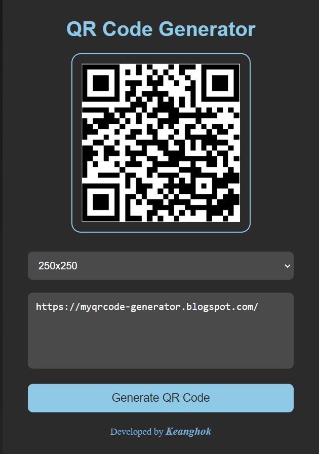

# 🚀 QR Code Generator 🎨

Welcome to the **QR Code Generator**! This web application allows you to create QR codes easily and efficiently.

## 🌟 Features

- 🌀 Generate QR Codes quickly and easily
- 📏 Choose from different sizes (100x100, 150x150, 200x200, 250x250, 300x300)
- 💬 Enter custom text to generate your unique QR code
- 📷 Instant preview of your QR code

## 🛠️ Getting Started

To get started with the QR Code Generator, follow these steps:

1. **Clone the repository:**
   ```bash
   git clone https://github.com/Kheav-Kienghok/Qr-Code-Generator

2. **Navigate to the project directory:**
    ```bash
    cd Qr-Code-Generator

3. **Open the index.html file in your browser:**
    ```bash
    start index.html

4. **Customize and generate your QR code!**

## 📋 Usage

1. **Select the desired QR code size** from the dropdown menu.
2. **Enter the text** you want to encode in the provided textarea.
3. **Click the "Generate QR Code" button** to see your QR code.
4. **Download or share the QR code** by right-clicking on the image and selecting "Save image as..." or sharing the image link.

## 🖼️ Screenshots



## 🎨 UI/UX Design

The interface is designed to be clean, user-friendly, and visually appealing. It features:
- A modern, dark theme with subtle gradients and shadow effects
- Smooth transitions for a better user experience
- Responsiveness to different screen sizes

## 💡 Technologies Used

- HTML5
- CSS3
- JavaScript
- [QR Code API](https://goqr.me/api/)

## 🌐 Demo

Check out the live demo [here](https://myqrcode-generator.blogspot.com/).

## 🤝 Contributing

Contributions are welcome! 

**Happy coding!** ✨